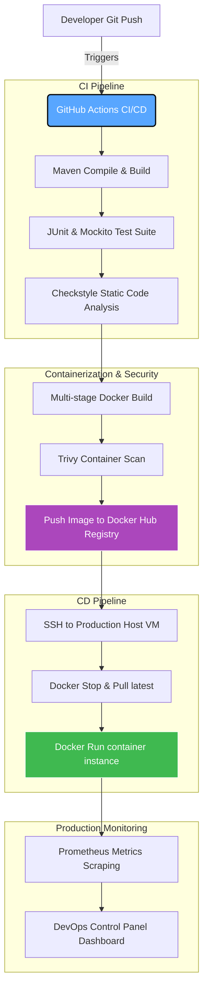

# End-to-End CI/CD Pipeline for Java Web Application (Docker VM Model)

This repository contains a comprehensive DevOps project demonstrating a production-grade, end-to-end Continuous Integration and Continuous Deployment (CI/CD) pipeline for a Java web application targeting a Docker container execution model.

It includes a fully functional Java Spring Boot REST microservice, enterprise-grade Docker orchestration configs, a local pipeline automation script, and a sleek, interactive frontend **DevOps Control Panel Dashboard**.

---

## 🚀 Project Architecture

The architecture illustrates modern DevOps practices, taking code from local developer git commits to a fully monitored production Docker Host VM:



---

## 📂 Project Directory Structure

```text
java-cicd-pipeline/
├── app/                              # Java Spring Boot Microservice
│   ├── pom.xml                       # Maven dependencies & build settings
│   └── src/
│       ├── main/java/com/devops/app/ # Spring Boot source code (Health Controller)
│       └── test/java/com/devops/app/ # Automated JUnit test suites
├── .github/workflows/
│   └── ci-cd.yml                 # Production GitHub Actions workflow (SSH VM Deploy)
├── Dockerfile                        # Multi-stage optimized, security-hardened Dockerfile
├── docker-compose.yml                # Local multi-container stack (App + Prometheus monitoring)
├── monitoring/
│   └── prometheus.yml                # Prometheus scraping metrics rule configuration
├── run-pipeline.ps1                  # Local PowerShell Pipeline Runner / Simulator (Docker Logs)
├── dashboard/                        # Web DevOps Control Panel Dashboard (Docker Mode)
│   ├── index.html                    # Dashboard layout structure
│   ├── style.css                     # Premium Glassmorphism styling and animations
│   └── app.js                        # Pipeline orchestration, metrics & logs panel logic
└── README.md                         # Project documentation
```

---

## 🛠️ Components Walkthrough

### 1. Spring Boot Web Application ([app/](file:///C:/Users/DELL/.gemini/antigravity/scratch/java-cicd-pipeline/app))
- **Tech Stack**: Java 17, Spring Boot 3.2.5, Spring Web, Spring Boot Actuator.
- **REST Endpoints**:
  - `GET /api/health`: Emits application health indicators, service statuses, database connections, and build versioning.
  - `GET /api/metrics`: Exposes memory allocation metrics (heap size, usage bounds), live threads, processor stats, and OS performance values.
  - `GET /api/info`: Metadata regarding the application build environment.
- **Tests**: Automated JUnit tests located in `HealthControllerTest.java` verifying endpoint health reports, ensuring pipeline stability before container packaging.

### 2. CI/CD Configuration Files
- **Multi-Stage [Dockerfile](file:///C:/Users/DELL/.gemini/antigravity/scratch/java-cicd-pipeline/Dockerfile)**:
  - **Stage 1 (Compile)**: Uses `maven:3.9.6-alpine` to compile Java sources. Keeps code and test libraries isolated from the release build.
  - **Stage 2 (Runtime)**: Uses `eclipse-temurin:17-jre-alpine` for a lightweight running size. Employs security hardening by registering a system user (`appuser`), abandoning root privileges, exposing port 8080, and applying an automated `HEALTHCHECK` checking endpoint health every 30s.
- **Docker Compose ([docker-compose.yml](file:///C:/Users/DELL/.gemini/antigravity/scratch/java-cicd-pipeline/docker-compose.yml))**:
  - Deploys the Java app alongside a **Prometheus** server container. Automatically configures Prometheus scraping paths to retrieve metrics from the JVM memory/cpu variables inside the app.
- **GitHub Actions pipeline ([.github/workflows/ci-cd.yml](file:///C:/Users/DELL/.gemini/antigravity/scratch/java-cicd-pipeline/.github/workflows/ci-cd.yml))**:
  - Automates build/test triggers upon pull requests or main branch pushes.
  - Runs code compilation, executes JUnit tests, archives test files, logons to registries, executes vulnerability scans via **Trivy**, builds container images, and deploys container configuration changes using SSH to a target Virtual Machine.

---

## 📈 Interactive DevOps Control Panel

The dashboard provides a premium graphical representation of the CI/CD pipeline, simulating or executing pipelines dynamically:

1. **Pipeline Stage Nodes**: Visualizes checkout, build, testing, security vulnerability scans, container docker building, and target VM container deployment.
2. **Vulnerability & Fault Injector**: Allows toggle selections to induce pipeline failures (compilation errors, unit test assertions failing, Log4j critical CVE flags, docker timeout issues, container out-of-memory crashes).
3. **Live Console Log Feed**: High-fidelity terminal displaying detailed scrolling outputs mimicking Maven builders, JUnit checkers, Trivy scans, Docker packagers, and Docker VM command execution logs.
4. **Scraping Monitors**: Animates resource meters showing CPU loads, Java heap allocations, traffic flows, response times, and target VM container status indicators.

---

## 💻 How to Run the Project

### Prerequisites
- Windows OS (using PowerShell).
- (Optional for full execution) Java Development Kit (JDK 17), Maven, and Docker installed locally.

### Step 1: Open the Interactive DevOps Control Panel
1. Locate the `dashboard/` directory.
2. Double-click [index.html](file:///C:/Users/DELL/.gemini/antigravity/scratch/java-cicd-pipeline/dashboard/index.html) to open the control panel in your default browser.
3. Click the **Trigger Pipeline** button. You can check fault switches to observe the pipeline halting at different nodes.

### Step 2: Running Pipeline Locally (Automation Script)
To run the *real* or *simulated* Maven compiling and container builds locally, launch PowerShell and execute:

```powershell
# Navigate to the project directory
cd C:\Users\DELL\.gemini\antigravity\scratch\java-cicd-pipeline

# To execute in Simulated Mode (Default)
.\run-pipeline.ps1

# To inject a JUnit Test Failure simulation
.\run-pipeline.ps1 -FailStage Test

# To run a REAL compile, test, and container packaging (requires mvn and docker installed)
.\run-pipeline.ps1 -Mode Real
```

Once the script completes, toggle the trigger mode selector on the Web Dashboard to **Load Latest Run** and click **Trigger Pipeline** to load the real console log metrics directly onto the browser dashboard!

### Step 3: Run the local microservice stack (App + Metrics)
If you have Docker installed, you can spin up the live Java Web Application alongside the Prometheus monitoring system:

```bash
# Spin up the containers
docker-compose up -d

# Verify container health
docker ps
```
The application will be accessible at `http://localhost:8080/api/health` and the Prometheus console at `http://localhost:9090`.
